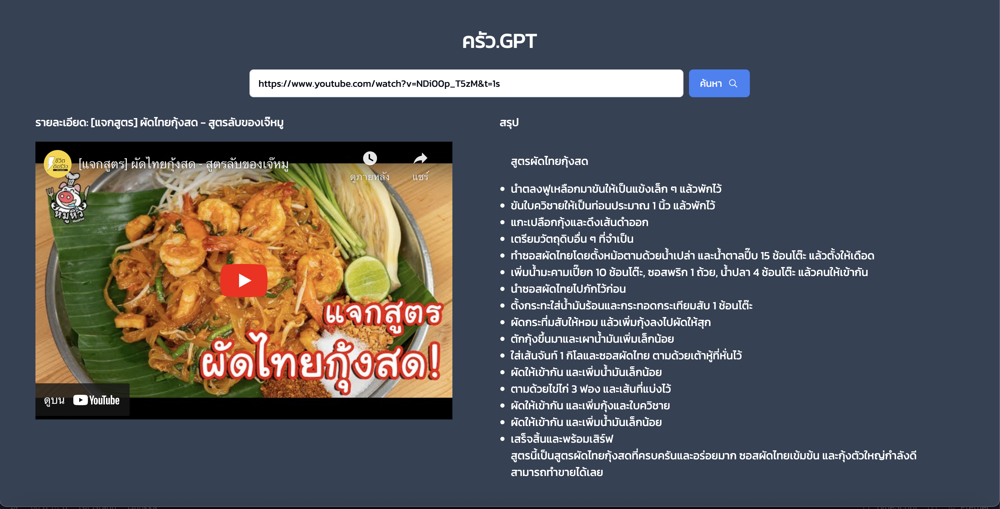
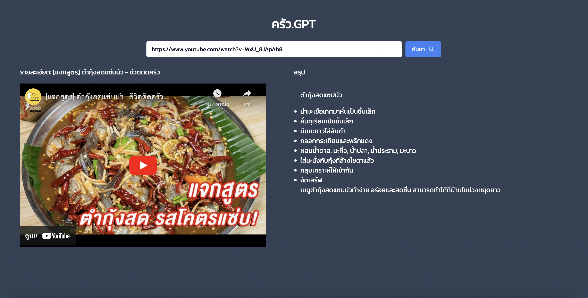
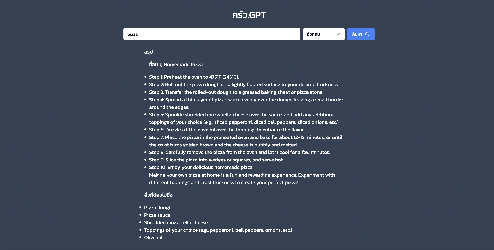

# Cooking with ChatGPT





https://github.com/niawjunior/cooking-gpt/assets/17493195/853aab4f-7144-4115-9346-66468344dbb2

Key Features:

- YouTube Video Input: The web application allows users to input a YouTube video URL into a designated textbox. Users can simply copy and paste the URL of the video they want to summarize.

- YouTube Video to MP3 Conversion: Upon submitting the YouTube URL, the application automatically extracts the audio from the video and converts it into an MP3 file. This ensures that the content can be efficiently processed for further analysis.

- Transcription to Text: The MP3 file is then sent to a transcription service powered by OpenAI's Whisper API. This service converts the audio into text, producing an accurate transcript of the video content.

- Summarization using ChatGPT: The obtained text transcription is further processed using OpenAI's powerful language model, ChatGPT. Utilizing ChatGPT's natural language processing capabilities, the application generates a concise and informative summary of the video content.

- Step-by-Step Cooking Instructions: For culinary-related videos, the application provides an additional feature to summarize cooking instructions as a step-by-step guide or in bullet points. Users can easily follow the summarized cooking steps for their favorite recipes.

- User-Friendly Interface: The user interface is designed to be intuitive and user-friendly, enabling effortless navigation and interaction. The application provides clear instructions and feedback to guide users through the process of summarizing their desired YouTube videos.

This is a [Next.js](https://nextjs.org/) project bootstrapped with [`create-next-app`](https://github.com/vercel/next.js/tree/canary/packages/create-next-app).

## Getting Started

First, run the development server:

```bash
npm run dev
# or
yarn dev
# or
pnpm dev
```

Open [http://localhost:3000](http://localhost:3000) with your browser to see the result.

You can start editing the page by modifying `app/page.tsx`. The page auto-updates as you edit the file.

This project uses [`next/font`](https://nextjs.org/docs/basic-features/font-optimization) to automatically optimize and load Inter, a custom Google Font.

## Learn More

To learn more about Next.js, take a look at the following resources:

- [Next.js Documentation](https://nextjs.org/docs) - learn about Next.js features and API.
- [Learn Next.js](https://nextjs.org/learn) - an interactive Next.js tutorial.

You can check out [the Next.js GitHub repository](https://github.com/vercel/next.js/) - your feedback and contributions are welcome!

## Deploy on Vercel

The easiest way to deploy your Next.js app is to use the [Vercel Platform](https://vercel.com/new?utm_medium=default-template&filter=next.js&utm_source=create-next-app&utm_campaign=create-next-app-readme) from the creators of Next.js.

Check out our [Next.js deployment documentation](https://nextjs.org/docs/deployment) for more details.
